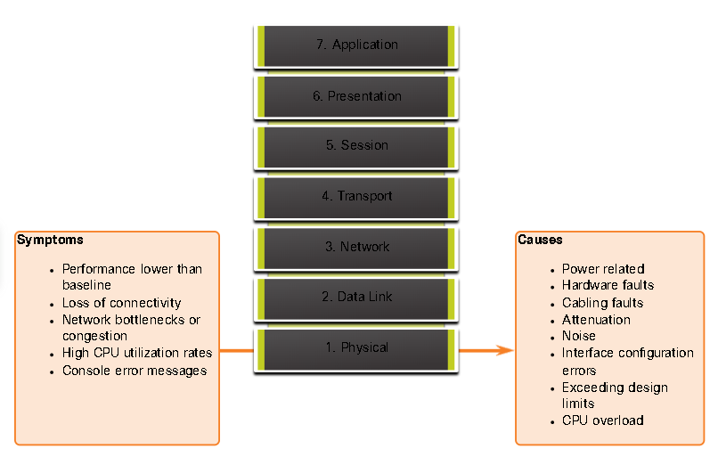
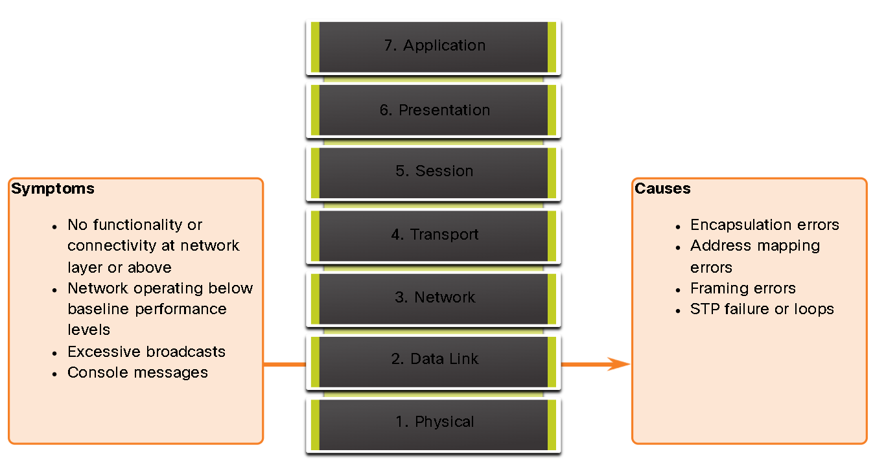
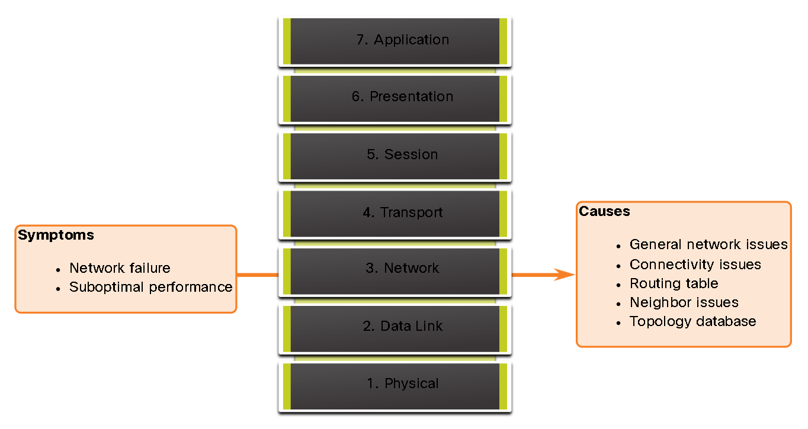
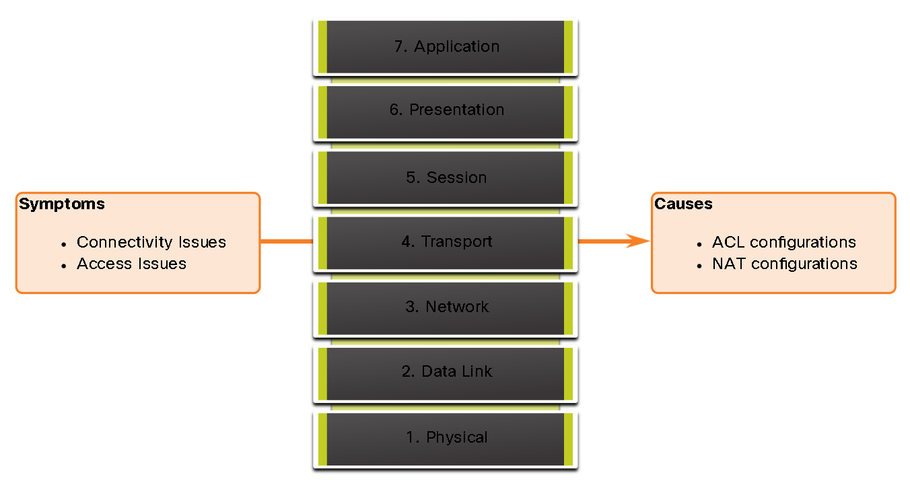
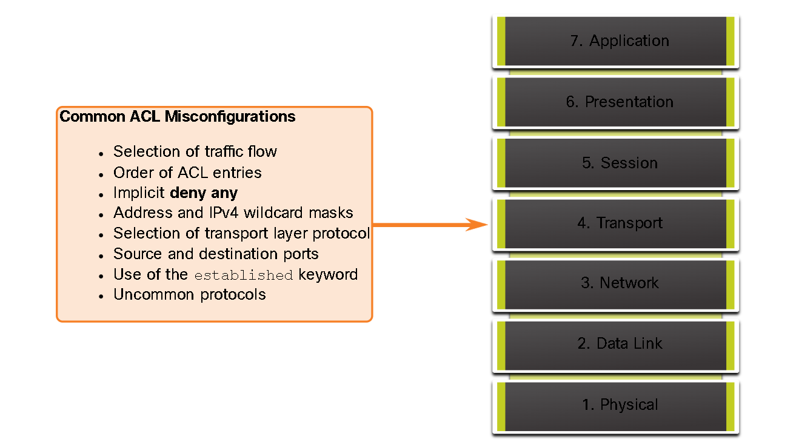
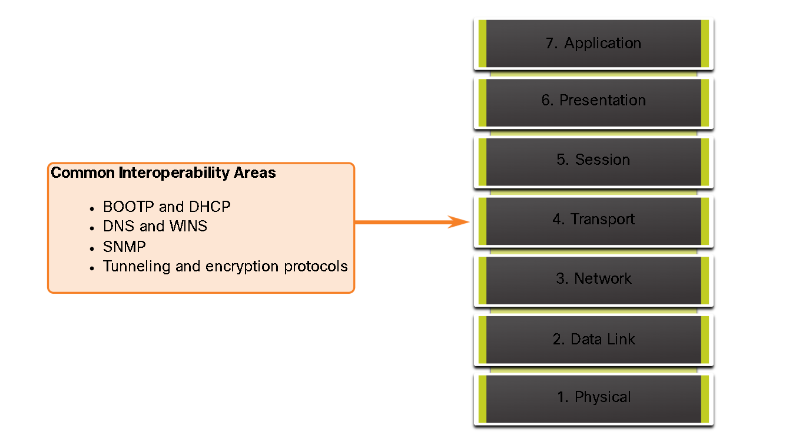
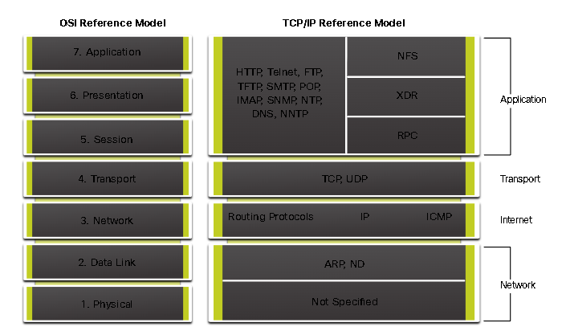

# OSI Model Troubleshooting

This guide provides a structured approach to identifying, diagnosing, and resolving network issues across the various layers of the OSI model.

## Table of Contents
1. [Physical Layer Troubleshooting](#1-physical-layer-troubleshooting)
2. [Data Link Layer Troubleshooting](#2-data-link-layer-troubleshooting)
3. [Network Layer Troubleshooting](#3-network-layer-troubleshooting)
4. [Transport Layer Troubleshooting](#4-transport-layer-troubleshooting)
5. [Application Layer Troubleshooting](#5-application-layer-troubleshooting)
6. [Key Concepts Glossary](#6-key-concepts-glossary)
7. [Minigame](#7-lets-learn-while-playing)

---

## 1. Physical Layer Troubleshooting
The physical layer represents the hardware foundation of your network. Problems here often manifest as performance issues or total loss of connectivity.

### Symptoms
* **Performance lower than baseline:** Requires previous baselines for comparison. Most common reasons include overloaded or underpowered servers, traffic congestion, and chronic frame loss.
* **Loss of connectivity:** Could be due to a failed or disconnected cable.
* **Network bottlenecks or congestion:** If a device fails, routing protocols may redirect traffic to routes not capable of carrying the extra capacity.
* **High CPU utilization rates:** A symptom that a device is operating at or exceeding its design limits.
* **Console error messages:** Could indicate a physical layer problem.

### Common Causes
* **Power-related:** Most fundamental reason for network failure.
* **Cabling faults:** Damaged cables, improper cable types, and connectors.
* **Attenuation:** If a cable length exceeds the design limit for the media, the receiving device cannot distinguish bits.
* **Interface configuration errors:** Incorrect clock rate, incorrect clock source, or interface not turned on.

---

## 2. Data Link Layer Troubleshooting
Layer 2 handles the framing and transmission of data between connected devices on the same link.

### Symptoms
* **No functionality or connectivity at L2 or above:** Can stop the exchange of frames.
* **Network operating below baseline:** Performance degradation.

---

## 3. Network Layer Troubleshooting
This layer involves logic like IPv4, OSPF, and EIGRP. Problems generally break down into two main symptoms and five underlying causes.

### Symptoms
* **Network failure:** A total loss of service affecting all users and applications.
* **Suboptimal performance:** Slowness or glitches affecting only a subset of users or specific traffic.

### Causes to Investigate
* **General network issues:** Recent changes in topology, such as down links or installation/removal of routes.
* **Connectivity issues:** Hardware failures, power outages, environmental problems (overheating), or Layer 1 problems.
* **Routing table:** Improperly configured static routes or missing/unexpected dynamic routes.
* **Neighbor issues:** Failures in establishing an adjacency with neighboring routers.
* **Topology database:** Unexpected or missing entries within the routing protocol's topology table.

---

## 4. Transport Layer Troubleshooting
Troubleshooting at this layer typically focuses on security policies and address translation.

### ACLs
**Symptoms**
* Connectivity Issues
* Access Issues

**Causes**
* ACL configurations
* NAT configurations

**The most common issues with ACLs are caused by improper configuration:**
* Selection of traffic flow
* Order of ACL entries
* Implicit deny any
* Address an IPv4 wildcard masks
* Selection of transport layer protocol
* Source and destination ports
* Use of the established keyword
* Uncommon protocols

### NAT for IPv4
NAT modifies IP headers to allow private devices to reach the public internet, but it can break protocols that carry IP addressing information inside their data payload.

**Common Interoperability Areas (Why protocols fail with NAT)**
* **BOOTP and DHCP:** These protocols embed IP configuration in the packet data; NAT cannot translate these internal addresses.
* **DNS and WINS:** NAT may fail to map internal naming requests to external IP responses.
* **SNMP:** Management traffic often includes internal IP references that get lost during translation.
* **Tunneling and encryption protocols:** NAT modifies headers, which invalidates the cryptographic integrity checks used in protocols like IPsec.

---

## 5. Application Layer Troubleshooting
This layer provides services directly to the user (email, file transfer, terminal emulation). When physical, network, and transport layers are functional, investigate the service logic here.

### Troubleshooting Approach
* **Service Availability:** Is the application daemon or service actually running on the server?
* **Port Listening:** Verify that the server is listening on the expected TCP/UDP port (e.g., via `netstat` or `ss`).
* **Protocol Mismatch:** Are both client and server speaking the same version of the protocol?
* **Authentication/Authorization:** Is access denied due to invalid credentials rather than a network block?
* **DNS Resolution:** Can the client resolve the domain name to the correct IP address?

### Protocols
* **SSH/Telnet:** Enables user to establish terminal session connections with remote hosts.
* **HTTP:** Supports the exchanging of text, graphic images, sound, video, and other.
* **FTP:** Performs interactive file transfers between hosts.
* **TFTP:** Performs basic interactive file transfers.
* **SMTP:** Supports basic message delivery services.
* **POP:** Connects to mail servers and downloads email.
* **SNMP:** Management devices in networks.
* **DNS:** Maps IP addresses to names assigned to devices.
* **Network File System (NFS):** Storage protocol that allows devices to access shared files in a remote server.

---

## 6. Key Concepts Glossary
* **Baseline:** A snapshot of "normal" network performance used for comparison.
* **Attenuation:** The natural weakening of a signal as it travels over a wire.
* **Adjacency:** The "handshake" between two routers needed to exchange routing information.
* **Topology Database:** A router's internal "map" of the network and all known routes.
* **ACL (Access Control List):** A security filter applied to an interface to allow or drop packets.
* **NAT (Network Address Translation):** Method to modify IP addresses, allowing private devices to share a public IP.

## Let's learn while playing!
Once you read this summarize about troubleshooting in the OSI Model, then you are ready to play and learn at the same time. We are going to **gimkit**, a platform where students answer questions in their own devices while they're competing against others to be the best.

## How to access?
To start playing you will have to click: gimkit.com/join

Once you are there, you will have to enter the code provided by one of us! 
